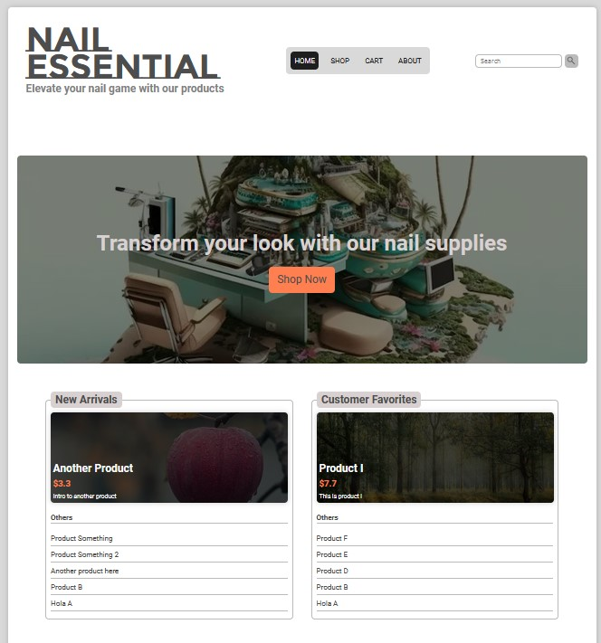

# Nail Supply Shop - Second Iteration

## Overview

In this second iteration, based on the insights gained from the [first attempt](https://github.com/ledminh/nail-supply-shop), I have transformed the project into a fully functional app with a database and authentication for the admin panel.

To ensure a seamless design process, I have leveraged Storybook for creating and managing the design system.

## Technology Stack

- **Framework:** Next.js
- **Database:** Prisma, PostgreSQL, lowdb (for mockup)
- **Authentication:** Clerk
- **Styles:** SCSS, CSS Modules
- **Design System:** Storybook

## Screenshot


## Live Demo

You can check out the live demo of this iteration at [this link](https://nail-supply-shop-v2.vercel.app).

To test the checkout feature, you can use the credit card number 4242 4242 4242 4242 with any CVC, as long as the expiration date is in the future.

For administrative access, please use the following credentials:

- **Admin URL:** [https://nail-supply-shop-v2.vercel.app/admin](https://nail-supply-shop-v2.vercel.app/admin)
- **Username:** store_admin
- **Password:** admin_54321


## Deployment Instructions

To deploy this project on your local machine, follow these steps:

1. Clone this project to your computer:

   ```sh
   git clone https://github.com/ledminh/nail-supply-shop-v2
   ```

2. Install dependencies:

   ```sh
   npm install
   ```

3. Set up your PostgreSQL database or sign up for one (I recommend using supabase.com). Obtain the database URL and add it to the following environment variables in the `.env` file located at the root of your project (same level as the `src` folder).
   
   - DATABASE_URL: URL for Prisma to connect to your PostgreSQL database.
   - DIRECT_URL: Same as above.

4. Create a new storage in your Supabase account and add the following variables to the `.env.local` file located at the root of your project:

   - SUPABASE_STORAGE_URL: You can find this value by following these steps: After logging into your Supabase dashboard, click on "Settings" in the side menu, then navigate to "API." The value is located in the "Project URL" section.
   - SUPABASE_API_KEY: The value can be found in the "Settings" > "API" > "Project API keys" section.

5. Within your newly created storage, create a new bucket named "nail-supply-store." Inside this bucket, create two folders: "category" and "product."

6. Add SUPABASE_IMAGE_URL to the `.env.local` file. This URL typically follows this format: `https://your-host-name.supabase.co/storage/v1/object/public/your-storage-name`.

7. Create a new account on Stripe to obtain STRIPE_SECRET_KEY and NEXT_PUBLIC_STRIPE_PUBLIC_KEY. Ensure that you set it to "Test mode" so that you can utilize the credit card number 4242 4242 4242 4242 for testing the checkout feature.

8. Create a new account on Clerk, add a new application to acquire NEXT_PUBLIC_CLERK_PUBLISHABLE_KEY and CLERK_SECRET_KEY, then add them to your `.env.local` file.

9. In the Clerk application you created, create a new user and enable login by username or email address. Copy the user ID and add it to the ADMIN_ID variable in your `.env.local` file.

10. Since this project uses Next.js, the remaining deployment process is similar to any other Next.js app. You can run the development server with the following command:

      ```sh
      npm run dev
      ```

11. If you intend to deploy it to your own server, follow these steps:

      - Build the project:
   
        ```sh
        npm run build
        ```
   
      - Start the server:
   
        ```sh
        npm run start
        ```

## Continuing Development

Here is a list of tasks for the ongoing development of this project:

- Implement a customer login feature.
- Set up email confirmation for customers after checkout.
- Enhance the user interface.
- Incorporate additional animations to improve the user experience.


## Other Iterations:

- [Nail Supply Shop v1](https://github.com/ledminh/nail-supply-shop)
- [My Favorite Shop](https://github.com/ledminh/my-favorite-shop)


